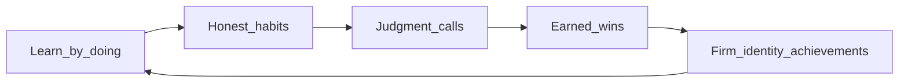

# Authenticity + education north-star

**Date:** 2026-07-14  
**Status:** Design pin — reuse this when judging market, feedback, onboarding, and economy changes.  
**Related:** Core fantasy in [`phase1-office-dashboard-handoff.md`](phase1-office-dashboard-handoff.md) (feel **richer, smarter, or more respected**).

---

## One sentence

StockWay is a **compressed real-life trading desk**: newcomers study by doing; after the lessons stick, the same systems stay fun because **good decisions feel earned** and **progress feels respected**—not because the market was nerfed or buffed.

---

## Pillars

| Pillar | Meaning for StockWay |
|--------|----------------------|
| **Teach** | First hours: size, risk, debt≠wealth, patience, credit |
| **Authenticity** | Outcomes feel like markets/finance: sometimes “damn that was good,” sometimes grind |
| **Joy of right decisions** | Celebrate *process* (sized right, waited, paid on time), not only lucky P&L |
| **Joy of achievement** | Clear milestones (REP, NW ladder, collection, office) without paying players for cheating systems |
| **Stay after studying** | Late game is empire/identity + harder judgment calls, not a solved money printer |

---

## What NOT to optimize for

- **Not** “make it harder” as a goal
- **Not** “make it easier so they don’t quit”
- **Not** tick-perfect live Yahoo as the main loop (too slow, still not educational)
- **Yes** keep accelerated time (`~30 min = 1 game day`) + **honest structure** (costs, chop, delayed feedback, credit)

---

## Design rule: reward the decision, not the exploit

When a player feels good, it should be traceable to one of:

1. **Process win** — followed size/risk/credit rules even if P&L was flat  
2. **Outcome win** — green day / closed winner after a real setup  
3. **Identity win** — REP rank, mega goal, estate, collection, office tier  

If a feeling of “good” only comes from **scanner deals / AI certainty / AFK staff**, authenticity breaks.

---

## Phase order (do in this sequence)

| Phase | Goal | Primary touch points |
|-------|------|----------------------|
| **A — Honesty layer** | Trust the tape; no “fake Bloomberg.” Live quotes as seeds; sim runs the session. Chart last candle matches trade price; clear *Simulated tape · live-seeded* status. | `js/chart.js`, `js/ui/chart-panel.js`, `js/api.js`, help/glossary |
| **B — Market texture** | Electric some days, choppy many; fewer free answers (less GREAT DEAL / AI certainty as free money). Fakeout/chop so early-right can still stop out. Deal desk = skill tool. | `js/market.js`, `js/ui/listings.js`, `js/ai.js`, `js/events.js` |
| **C — Process feedback** | Dopamine from discipline, not only jackpots. Day-summary callouts for process; soft REP/flair; cash only for true milestones; mega goals flair-first. | `js/day-end.js`, `js/ui.js`, `js/achievements.js`, `js/meta.js`, `js/mega-goals.js` |
| **D — Study → desk** | First days teach one habit at a time; after onboarded, desk prestige / firm fantasy. Explicit graduation (e.g. Trusted Trader) then trust the player. | Walkthrough / perk callouts, REP copy |
| **E — Balance like life** | Skill wins; AFK/leverage can feel hot then cold. Keep bank/credit pain and real staff costs. Mid-game: readable recovery levers, not free cash. Validate with `scripts/balance-500-day.cjs`. | Economy / staff / credit only where authenticity breaks |

### First build slice (after plan approval)

Implement **Phase A + thin Phase C** first:

1. Trust/status honesty on market/chart  
2. Day-summary “process wins” (2–4 callouts max, no economy rewrite)  
3. One glossary/help paragraph: “Compressed realism — same lessons, faster clock”  

Defer full rough-tape (**B**) and economy retune (**E**) until authenticity of *feedback* lands.

---

## Success metrics

- Newcomer can explain after day 5: *equity vs cash, why debt isn’t profit, why size matters*
- Players sometimes say “that setup paid” **and** sometimes “I did everything right and still scratched”—both feel fair
- Achievements/milestones get screenshots; exploit paths (infinite loan churn, AFK staff print) do not
- Post-tutorial session length stays high because **identity + judgment** remain, not because grind is mandatory
